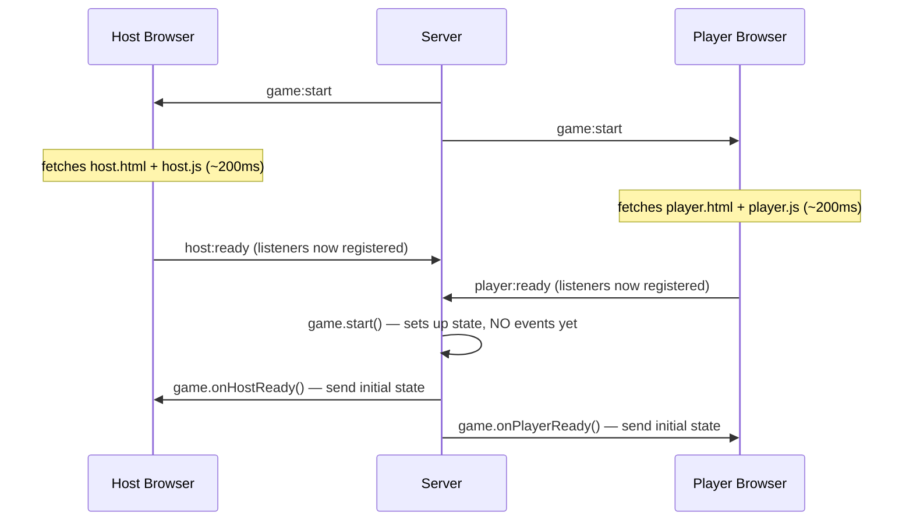

# OpenBox — Game Developer Guide

> How to build a new game from scratch, drop it in the `games/` folder, and have it work immediately.

---

## How the Framework Works

The host PC runs an Express + Socket.IO server. When a game starts:

1. The host browser fetches **`host.html`** and **`host.js`** from your game folder and injects them into the TV screen
2. Each player's browser fetches **`player.html`** and **`player.js`** and injects them into their phone screen
3. Your files communicate with the server via the global `socket` object — already connected by the shell

### The push/pull startup pattern

This is the most important thing to understand. There is a race condition that must be avoided:



**`start()` must never emit socket events.** By the time it's called, the host browser is still fetching your files. Any events emitted in `start()` arrive before listeners are registered — they are lost forever.

Instead:
- `onHostReady()` → called once the host browser is ready → send initial state to `hostSocket`
- `onPlayerReady()` → called once each player browser is ready → send initial state to `socket`
- Subsequent events (round 2+) can broadcast normally since all UIs are already loaded

---

## File Structure

```
games/
└── mygame/
    ├── game.js        ← server logic (required)
    ├── host.html      ← TV screen UI fragment (required)
    ├── host.js        ← TV screen event handlers (required)
    ├── player.html    ← phone UI fragment (required)
    ├── player.js      ← phone event handlers (required)
    └── assets/        ← any static files (images, JSON, etc.)
        └── data.json  ← served at /games/mygame/assets/data.json
```

The framework auto-discovers your game on server start — no registration needed. The folder name becomes the static asset URL path (`/games/mygame/`).

---

## game.js — Server Logic

### Full export shape

```js
let state    = {};
let _endGame = null;  // always outside state — see Critical Rules

module.exports = {
  id:         "mygame",       // unique key, matches folder name
  name:       "🎯 My Game",   // shown in the lobby
  minPlayers: 2,
  maxPlayers: 8,

  // Called once when host clicks Start.
  // Set up state here — DO NOT emit any socket events.
  start({ io, players, endGame }) {
    _endGame = endGame;
    state = { io, players, timer: null /* ... */ };
    state.timer = setTimeout(() => module.exports._myPhase(), 30000);
  },

  // Called after the host browser finishes loading host.html + host.js.
  // Send current game state to hostSocket only.
  onHostReady({ hostSocket, io, players }) {
    if (!state.phase) return;
    hostSocket.emit("mygame:state", { /* current state */ });
  },

  // Called after each player's browser finishes loading player.html + player.js.
  // Send initial state to this player's socket only.
  onPlayerReady({ socket, player, io, players }) {
    socket.emit("mygame:your_role", { /* this player's state */ });
  },

  // Called when a player sends player:action.
  onPlayerAction({ socket, player, payload, io, players }) {
    if (payload.type === "answer") { /* ... */ }
  },

  // Called when the host sends host:action.
  onHostAction({ socket, payload, io, players }) {
    if (payload.type === "skip") { /* ... */ }
  },

  // Called when game ends (host force-stop or endGame()).
  // Always clear timers here.
  onEnd() {
    clearTimeout(state.timer);
    state    = {};
    _endGame = null;
  },

  // Optional: handle a player joining mid-game.
  onPlayerJoin({ socket, player, io, players }) { /* ... */ },

  // Private helpers (not called by the framework)
  _myPhase() { /* ... */ },
};
```

### Context parameters

All lifecycle methods receive these named parameters:

| Parameter | Type | Description |
|-----------|------|-------------|
| `io` | Socket.IO Server | `io.emit()` → everyone, `io.to("host").emit()` → TV only, `io.to("players").emit()` → all phones |
| `players` | Object | `{ [socketId]: { id, name, socket } }` — use `players[id].socket.emit()` to message one player |
| `endGame` | Function | Returns everyone to the lobby. Store as `_endGame` outside state |
| `socket` | Socket | The specific socket for this player (in per-player methods) |
| `player` | Object | `{ id, name }` for this specific player |
| `payload` | Object | Data sent by the client via `player:action` or `host:action` |
| `hostSocket` | Socket | The host's socket (in `onHostReady` only) |

---

## host.html + host.js — TV Screen

### host.html

An HTML fragment (no `<html>`, `<head>`, or `<body>` tags) injected into `#game-container` on the host shell. Can contain `<style>` blocks and any valid HTML.

**Rules:**
- Use CSS variables for colours: `var(--accent)`, `var(--yellow)`, `var(--green)`, `var(--pink)`, `var(--panel)`, `var(--bg)`, `var(--text)`, `var(--muted)`
- Fonts `Fredoka One` and `Nunito` are loaded by the shell and ready to use
- Prefix all IDs with your game id to avoid collisions: `mygame-panel`, `mygame-score`
- **Never** hide panels with `display:none` in CSS — use inline `style="display:none"` on the HTML element, or set `style.display = "block"` explicitly in JS (see Critical Rules)

### host.js

```js
// socket is a global provided by the host shell
(() => {
  function $(id) { return document.getElementById(id); }

  function showPanel(id) {
    ["mygame-panel-a", "mygame-panel-b"]
      .forEach(p => $(p).style.display = p === id ? "block" : "none");
  }

  socket.on("mygame:round_start", ({ round, prompt }) => {
    $("mygame-round").textContent  = `Round ${round}`;
    $("mygame-prompt").textContent = prompt;
    showPanel("mygame-panel-a");
  });

  socket.on("mygame:result", ({ winner }) => {
    $("mygame-winner").textContent = winner;
    showPanel("mygame-panel-b");
  });
})();
```

Wrap everything in an IIFE `(() => { ... })()` to avoid polluting the global scope.

---

## player.html + player.js — Phone Screen

### player.html

Same rules as `host.html`. Design for narrow screens (max ~420px). The shell provides these shared CSS classes:

- `ob-input` — styled text input
- `ob-btn ob-btn-primary` — styled button

### player.js

```js
// socket is a global provided by the player shell
(() => {
  function $(id) { return document.getElementById(id); }

  function showView(id) {
    ["mygame-write-view", "mygame-vote-view", "mygame-wait-view"]
      .forEach(v => $(v).style.display = v === id ? "" : "none");
    // "" works here because these views use inline style="display:none"
  }

  socket.on("mygame:your_turn", ({ prompt }) => {
    $("mygame-prompt").textContent = prompt;
    showView("mygame-write-view");
  });

  $("mygame-submit").onclick = () => {
    const text = $("mygame-input").value.trim();
    if (!text) return;
    $("mygame-input").disabled  = true;
    $("mygame-submit").disabled = true;
    socket.emit("player:action", { type: "answer", text });
  };
})();
```

---

## Socket Event Reference

### Framework events (sent by the framework, listen in your UI files if needed)

| Event | Direction | Payload |
|-------|-----------|---------|
| `game:start` | Server → All | `{ gameId, gameName }` — triggers shells to load your UI fragments |
| `game:end` | Server → All | `{}` — triggers shells to unload your fragments and return to lobby |
| `lobby:update` | Server → All | `{ players, games }` — fires when players join/leave |
| `host:show_action` | Server → Host | `{ label, type }` — shows a floating button on the TV |
| `host:hide_action` | Server → Host | `{}` — removes the floating button |
| `host:error` | Server → Host | `string` — shown as an error in the lobby |

### Player → Server

| Event | Notes |
|-------|-------|
| `player:action` | Payload is any object — received in `onPlayerAction({ payload })` |
| `player:ready` | Sent automatically by the shell after `player.js` loads — triggers `onPlayerReady()`. Do not emit manually. |

### Host → Server

| Event | Notes |
|-------|-------|
| `host:action` | Payload is any object — received in `onHostAction({ payload })` |
| `host:ready` | Sent automatically by the shell after `host.js` loads — triggers `onHostReady()`. Do not emit manually. |
| `host:end_game` | Host clicks End Game button — calls `endGame()` regardless of game state |

### Reserved prefixes — never use these for your own events

`game:` `host:` `player:` `lobby:`

Prefix your own events with your game id: `mygame:event_name`.

---

## The Host Action Button

Games can show a contextual floating button on the TV — useful for skipping phases, forcing reveals, or any host-controlled action.

```js
// game.js — show the button
io.to("host").emit("host:show_action", { label: "⏭ Skip Round", type: "skip" });

// game.js — hide it
io.to("host").emit("host:hide_action");

// game.js — handle the click
onHostAction({ payload }) {
  if (payload.type === "skip") {
    clearTimeout(state.timer);
    game._nextPhase();
  }
},
```

The host also always has a permanent **End Game** button — this calls `endGame()` directly, so always clean up in `onEnd()`.

---

## Critical Rules

### 1. Store `endGame` outside `state`

```js
// ❌ Wrong — if onEnd() wipes state before a timeout fires, endGame is gone
state = { io, players, endGame };
setTimeout(() => state.endGame(), 5000); // TypeError: state.endGame is not a function

// ✅ Correct
let _endGame = null;

start({ endGame }) {
  _endGame = endGame;
  state = { io, players };          // endGame NOT in state
  setTimeout(() => _endGame(), 5000); // always works
},

onEnd() {
  clearTimeout(state.timer);
  state    = {};
  _endGame = null;
},
```

### 2. `start()` emits nothing

```js
// ❌ Wrong — host.js hasn't loaded yet, this event is lost
start({ io }) {
  io.emit("mygame:question", { prompt: "..." }); // nobody listening yet
},

// ✅ Correct — wait for the pull
start({ io, players, endGame }) {
  _endGame = endGame;
  state = { io, players, prompt: "What is 2+2?" };
  // no emit — onHostReady and onPlayerReady will handle it
},

onHostReady({ hostSocket }) {
  hostSocket.emit("mygame:question", { prompt: state.prompt });
},

onPlayerReady({ socket }) {
  socket.emit("mygame:your_turn", { prompt: state.prompt });
},
```

### 3. Always use an explicit display value

```js
// ❌ Wrong — if the CSS has #my-panel { display: none },
//            setting "" just removes the inline style, CSS wins, panel stays hidden
$("my-panel").style.display = "";

// ✅ Correct — inline style overrides CSS
$("my-panel").style.display = "block";  // or "flex", "grid", etc.

// ✅ Also correct — "" works only when the element was hidden
//                   via inline style="display:none" (not a CSS rule)
$("my-panel").style.display = "";
```

### 4. Clear all timers in `onEnd()`

```js
onEnd() {
  clearTimeout(state.roundTimer);
  clearTimeout(state.revealTimer);
  clearInterval(state.tickInterval);
  state    = {};
  _endGame = null;
},
```

### 5. Re-enable inputs between rounds

DOM elements persist across rounds — disabled inputs stay disabled.

```js
// At the start of each phase that shows an input
$("my-input").value    = "";
$("my-input").disabled = false;
$("my-btn").disabled   = false;
$("my-sent").textContent = "";
```

---

## Minimal Working Example

The smallest complete game — one question, everyone answers, host sees results.

### game.js

```js
let state    = {};
let _endGame = null;

const game = {
  id: "example", name: "🎲 Example", minPlayers: 2, maxPlayers: 8,

  start({ io, players, endGame }) {
    _endGame = endGame;
    state = { io, players, answers: {}, timer: null };
    state.timer = setTimeout(() => game._reveal(), 30000);
  },

  onHostReady({ hostSocket }) {
    hostSocket.emit("example:question", { prompt: "What is 2 + 2?" });
    hostSocket.emit("host:show_action", { label: "⏭ Skip", type: "skip" });
  },

  onPlayerReady({ socket }) {
    socket.emit("example:your_turn", { prompt: "What is 2 + 2?" });
  },

  onPlayerAction({ socket, payload, players }) {
    if (payload.type !== "answer") return;
    state.answers[socket.id] = payload.text;
    socket.emit("example:answer_ack");
    if (Object.keys(players).every(id => state.answers[id])) {
      clearTimeout(state.timer);
      game._reveal();
    }
  },

  onHostAction({ payload }) {
    if (payload.type === "skip") {
      clearTimeout(state.timer);
      game._reveal();
    }
  },

  _reveal() {
    const { io, players } = state;
    io.to("host").emit("host:hide_action");
    io.emit("example:result", {
      answers: Object.entries(state.answers).map(([id, text]) => ({
        name: players[id]?.name ?? "?", text,
      })),
    });
    setTimeout(() => _endGame(), 8000);
  },

  onEnd() {
    clearTimeout(state.timer);
    state = {}; _endGame = null;
  },
};

module.exports = game;
```

### host.html

```html
<style>
  #ex-question { font-family:'Fredoka One',cursive; font-size:2.5rem; color:var(--yellow);
                 text-align:center; padding:40px 20px; }
  #ex-answers  { max-width:600px; margin:0 auto; }
  .ex-row      { background:var(--panel); border-radius:12px; padding:14px 20px;
                 margin-bottom:10px; font-weight:700; font-size:1.1rem; }
  .ex-name     { color:var(--accent); font-size:0.85rem; margin-bottom:4px; }
</style>

<div id="ex-question">What is 2 + 2?</div>
<div id="ex-answers" style="display:none"></div>
```

### host.js

```js
(() => {
  function $(id) { return document.getElementById(id); }

  socket.on("example:result", ({ answers }) => {
    $("ex-question").style.display = "none";
    $("ex-answers").style.display  = "block";
    $("ex-answers").innerHTML = answers.map(a => `
      <div class="ex-row">
        <div class="ex-name">${a.name}</div>
        ${a.text}
      </div>`).join("");
  });
})();
```

### player.html

```html
<style>
  #ex-write { text-align:center; padding:20px; }
  #ex-wait  { text-align:center; padding:40px; }
  .ex-prompt { background:var(--panel); border:2px solid var(--accent); border-radius:14px;
               padding:18px; font-weight:800; font-size:1.1rem; margin-bottom:16px; }
</style>

<div id="ex-write">
  <div class="ex-prompt" id="ex-prompt"></div>
  <input  id="ex-input"  class="ob-input"        placeholder="Your answer…" />
  <button id="ex-submit" class="ob-btn ob-btn-primary">Submit</button>
  <div    id="ex-sent"   style="color:var(--green);margin-top:8px;min-height:20px"></div>
</div>

<div id="ex-wait" style="display:none">
  <div style="font-size:3rem">⏳</div>
  <div style="font-family:'Fredoka One',cursive;font-size:1.5rem;color:var(--yellow)">
    Waiting for results…
  </div>
</div>
```

### player.js

```js
(() => {
  function $(id) { return document.getElementById(id); }

  socket.on("example:your_turn", ({ prompt }) => {
    $("ex-prompt").textContent   = prompt;
    $("ex-input").value          = "";
    $("ex-input").disabled       = false;
    $("ex-submit").disabled      = false;
    $("ex-sent").textContent     = "";
  });

  $("ex-submit").onclick = submit;
  $("ex-input").addEventListener("keydown", e => { if (e.key === "Enter") submit(); });

  function submit() {
    const text = $("ex-input").value.trim();
    if (!text) return;
    $("ex-input").disabled  = true;
    $("ex-submit").disabled = true;
    $("ex-sent").textContent = "Submitted!";
    socket.emit("player:action", { type: "answer", text });
  }

  socket.on("example:result", () => {
    $("ex-write").style.display = "none";
    $("ex-wait").style.display  = "block";
  });
})();
```

---

## Tips & Patterns

### Serving static assets

```js
// In game.js — load at startup
const data = require("./assets/data.json");

// In host.html / player.html — reference by URL

```

### Messaging one specific player

```js
// You have the socket directly (in onPlayerAction, onPlayerReady, etc.)
socket.emit("mygame:your_role", { role: "spy" });

// Or look it up by id
players[someId].socket.emit("mygame:update", { data });
```

### Keeping contenders out of the vote

```js
const contenders = [pair.playerA, pair.playerB];

Object.keys(players).forEach(id => {
  if (contenders.includes(id)) {
    players[id].socket.emit("mygame:wait", { msg: "Your answer is in the ring!" });
  } else {
    players[id].socket.emit("mygame:vote", { options: [...] });
  }
});
```

### Showing a progress bar on the host

```js
// In onPlayerAction, after each vote/answer comes in
io.to("host").emit("mygame:progress", {
  done:  Object.keys(state.answers).length,
  total: Object.keys(players).length,
});
```

```js
// In host.js
socket.on("mygame:progress", ({ done, total }) => {
  $("my-bar").style.width   = `${(done / total) * 100}%`;
  $("my-count").textContent = `${done} / ${total}`;
});
```

---

## Pre-launch Checklist

- [ ] `game.js` exports `id`, `name`, `minPlayers`, `maxPlayers`
- [ ] `start()` sets up state but emits nothing
- [ ] `onHostReady()` sends current state to `hostSocket`
- [ ] `onPlayerReady()` sends current state to `socket`
- [ ] `endGame` stored outside `state` as `_endGame`
- [ ] `onEnd()` clears all timers and resets `state` + `_endGame`
- [ ] All socket events prefixed with game id (`mygame:event_name`)
- [ ] All DOM IDs prefixed with game id (`mygame-panel`)
- [ ] Inputs re-enabled at the start of each phase
- [ ] `display:"block"` or `"flex"` used instead of `display:""` for CSS-hidden elements
- [ ] `host:hide_action` called before emitting result events
- [ ] Tested with minimum player count
- [ ] Tested with host force-stopping mid-game (End Game button)

---

## Existing Games for Reference

| Game | Good example of |
|------|----------------|
| `trivia/` | Simplest structure, timer pattern, scoreboard |
| `chameleon/` | Role assignment, secret info per player, majority voting, multi-phase flow |
| `drawguess/` | Real-time canvas streaming, waiting for all players ready before starting |
| `promptwar/` | Pairing algorithm, multi-prompt writing per player, anonymous voting |